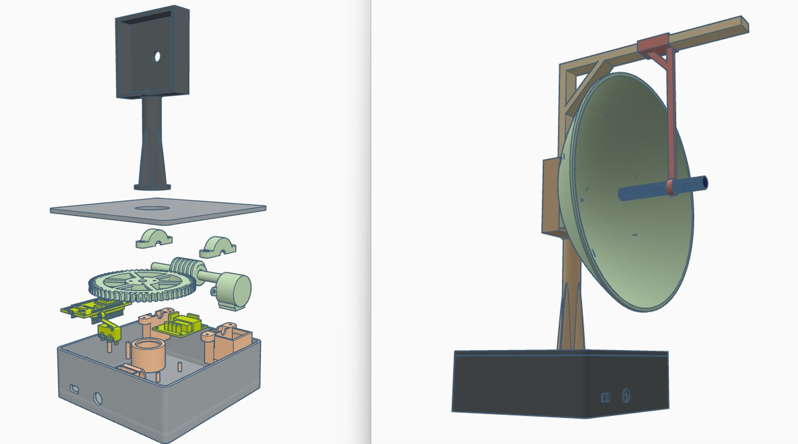

# Antenna Radiation Mapper

## Overview

The **Antenna Radiation Mapper** is a versatile tool for mapping antenna radiation patterns with high precision. This project provides an affordable solution for testing antennas, including parabolic reflectors, offering a straightforward setup and simple operation. The system combines automated data collection, precise antenna movement, and easy connectivity, making it ideal for both enthusiasts and professionals looking for an effective antenna testing tool.

Note: This project does not include signal processing features, as they are part of a separate project that cannot be disclosed. Feel free to implement your own signal processing methods if needed.

## Key Features

- **Precision Control:** Rotate the antenna with 0.01-degree accuracy.
- **Automated Measurements:** Handle sampling, gain calculations, and graph generation.
- **Connectivity:** Connect over WiFi or serial port for data collection.
- **Modular Design:** Easily swap antennas for testing different configurations.

## Components Needed

To build your own Antenna Radiation Mapper, you will need the following components:

- **Stepper Motor:**  28BYJ-48
- **Motor Driver:** ULN2003AN
- **Microcontroller:** NodeMCU V3 (ESP8266-based)
- **Bearings:** 4 x Bearings
- **Bolts & Nuts:** 4 x M3*10 Bolts, 4 x M3 Nuts
- **Micro Switch:** 1 Micro Switch

You’ll also need to print some custom-designed 3D parts, which are provided as STL files in the repository.

## Mechanical Setup

1. **3D Print the Required Parts:** Print all parts using the STL files located in the [STL Files Folder](STL_Files).
2. **Attach Bearings:** Insert the 4 bearings into the appropriate printed parts.

## Wiring Instructions

1. **Stepper Motor Wiring:**
   - **IN1:** Connect to pin **D1** on the NodeMCU.
   - **IN2:** Connect to pin **D2** on the NodeMCU.
   - **IN3:** Connect to pin **D3** on the NodeMCU.
   - **IN4:** Connect to pin **D4** on the NodeMCU.

2. **Micro Switch Wiring:**
   - Connect the micro switch to **LIMIT\_SWITCH\_PIN (D5)** on the NodeMCU.

3. **Power Supply:**
   - Provide power to both the driver and the NodeMCU. Ensure that they **share a common ground**.

## Software Setup

1. **Download the Code:** Clone or download the code from this repository.
2. **Microcontroller Code:** Flash the C code to the NodeMCU V3 using [PlatformIO](https://platformio.org/) or the Arduino IDE.
3. **Python Script for Serial Communication:** There is a Python script available in the repository that allows you to connect via serial communication and initiate antenna movements and data recordings.

## Explanation of Files

- **`main.cpp` (Microcontroller Control Code):**
  - This file contains the code for controlling the stepper motor using the NodeMCU. It also provides a web interface accessible at **192.168.4.1** once connected to the WiFi broadcast by the NodeMCU. Users can enter desired angles and control the movement of the antenna through this interface. The script manages commands like moving the antenna, setting a zero (home) position, and pausing.

- **`serial_audio_recorder.py` (Audio Recording and Analysis Script):**
  - This Python script is used to communicate with the microcontroller via serial connection. It listens for commands indicating specific positions (like "Start brake" and "End brake") and then records audio for each of these positions. The script also performs FFT (Fast Fourier Transform) analysis on the recorded audio to determine the frequency response of the antenna and saves these results to a CSV file (`frequency_analysis.csv`).

- **`graphFromCsv.py` (Graph Generation Script):**
  - This script takes the CSV file generated by `serial_audio_recorder.py` and generates graphs to visualize the antenna's performance. It provides functions to plot gain vs. angle for individual frequencies, as well as generate polar radiation patterns. This helps in understanding how the antenna performs at different frequencies and in different directions.

## Getting Started

1. **Power Up:** Make sure the driver, NodeMCU, and micro switch are powered properly.
2. **Connect to WiFi:** Connect to the WiFi network broadcasted by the NodeMCU. Once connected, access the control interface by navigating to **192.168.4.1** in your web browser.
3. **Initiate Testing:** Run the Python script (`serial_audio_recorder.py`) to communicate with the NodeMCU either via WiFi or using a serial connection.
4. **Recording and Analysis:** The Python script will automatically record audio and perform analysis whenever the motor movement pauses. Once testing is complete, the `graphFromCsv.py` script will generate graphs and analyze the antenna's radiation patterns.

## What to Expect

- **Web Interface Control:** You'll be able to control the antenna's movement using a simple web interface. Set the target angle, step size, and delay, and monitor the current position in real-time.
- **Audio Recording and Analysis:** The script records audio at each position, performs FFT to analyze signal properties, and saves the frequency response data to a CSV file.
- **Visual Data Representation:** After collecting data, run the `graphFromCsv.py` script to generate informative visualizations, including gain vs. angle graphs and polar plots. These visualizations will help you evaluate the radiation pattern of the antenna and determine its performance at different frequencies.

## Contributing

If you have any ideas for improving the project, feel free to open a pull request or submit an issue. Contributions are always welcome!

## License

This project is licensed under the MIT License. See the LICENSE file for more details.

## Contact

If you have any questions or issues with the setup, feel free to contact me through GitHub.

Enjoy building your own **Antenna Radiation Mapper**!

